# Лабораторная работа 2
## Задание 1

### min_max
### Входные данные и результат: 
#### [3, -1, 5, 5, 0] → (-1, 5)
#### [42] → (42, 42)
#### [-5, -2, -9] → (-9, -2)
#### [1.5, 2, 2.0, -3.1] → (-3.1, 2)
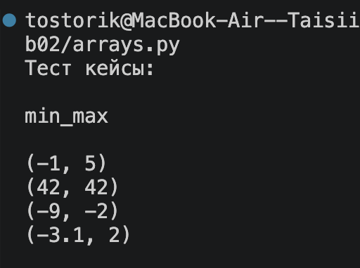
##### Рис.1 Иллюстрация работы программы(arrays), функции min_max

### Входные данные и результат:
#### [] → ValueError
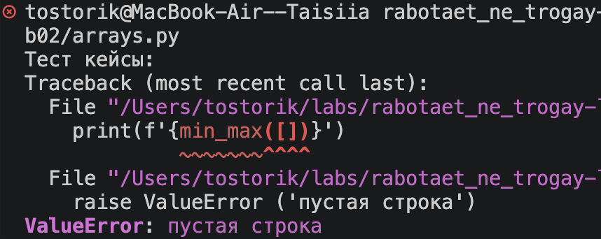
##### Рис.2 Иллюстрация работы программы(arrays), функции min_max

### unique_sorted
### Входные данные и результат: 
#### [3, 1, 2, 1, 3] → [1, 2, 3]
#### [] → []
#### [-1, -1, 0, 2, 2] → [-1, 0, 2]
#### [1.0, 1, 2.5, 2.5, 0] → [0, 1.0, 2.5]
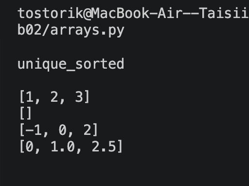
##### Рис.3 Иллюстрация работы программы(arrays), функции unique_sorted

### flatten
### Входные данные и результат:
#### [[1, 2], [3, 4]] → [1, 2, 3, 4]
#### [[1, 2], (3, 4, 5)] → [1, 2, 3, 4, 5]
#### [[1], [], [2, 3]] → [1, 2, 3]
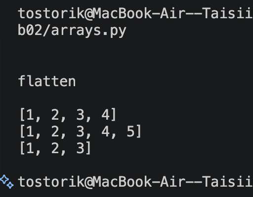
##### Рис.4 Иллюстрация работы программы(arrays), функции flatten

### Входные данные и результат:
#### [[1, 2], "ab"] → TypeError («строка не строка строк матрицы»)
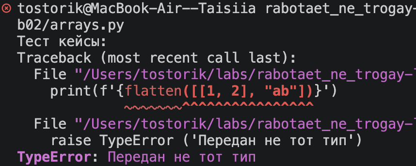
##### Рис.5 Иллюстрация работы программы(arrays), функции flatten

## Задание 2

### transpose

### Входные данные и результат:
#### [[1, 2, 3]] → [[1], [2], [3]]
#### [[1], [2], [3]] → [[1, 2, 3]]
#### [[1, 2], [3, 4]] → [[1, 3], [2, 4]]
#### [] → []
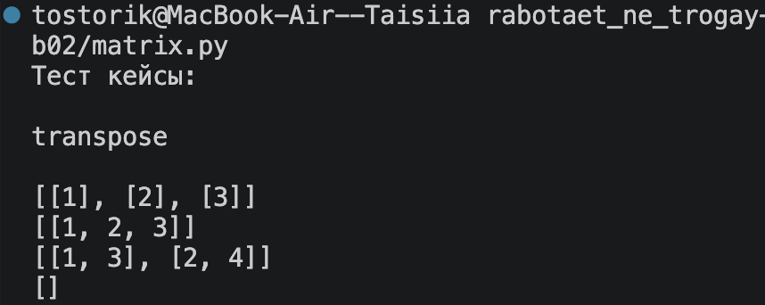
##### Рис.6 Иллюстрация работы программы(matrix), функции transpose

### Входные данные и результат:
#### [[1, 2], [3]] → ValueError (рваная матрица)
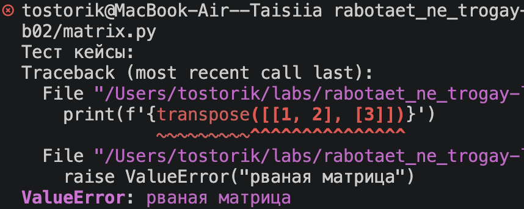
##### Рис.7 Иллюстрация работы программы(matrix), функции transpose

### row_sums

### Входные данные и результат:
#### [[1, 2, 3], [4, 5, 6]] → [6, 15]
#### [[-1, 1], [10, -10]] → [0, 0]
#### [[0, 0], [0, 0]] → [0, 0]
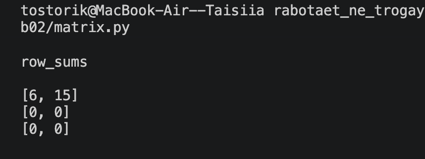
##### Рис.8 Иллюстрация работы программы(matrix), функции row_sums

### Входные данные и результат:
#### [[1, 2], [3]] → ValueError (рваная)
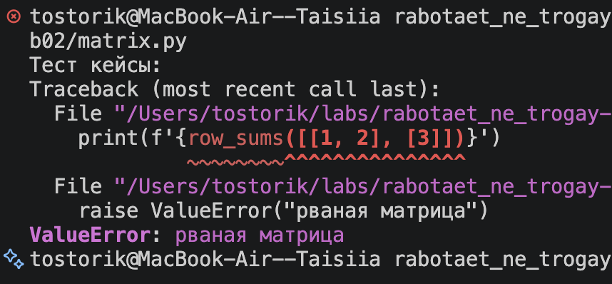
##### Рис.9 Иллюстрация работы программы(matrix), функции row_sums

### col_sums

### Входные данные и результат:
#### [[1, 2, 3], [4, 5, 6]] → [5, 7, 9]
#### [[-1, 1], [10, -10]] → [9, -9]
#### [[0, 0], [0, 0]] → [0, 0]
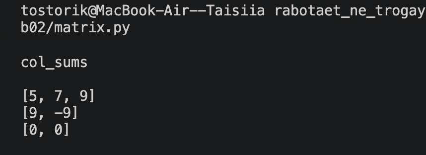
##### Рис.10 Иллюстрация работы программы(matrix), функции col_sums

### Входные данные и результат:
#### [[1, 2], [3]] → ValueError (рваная)
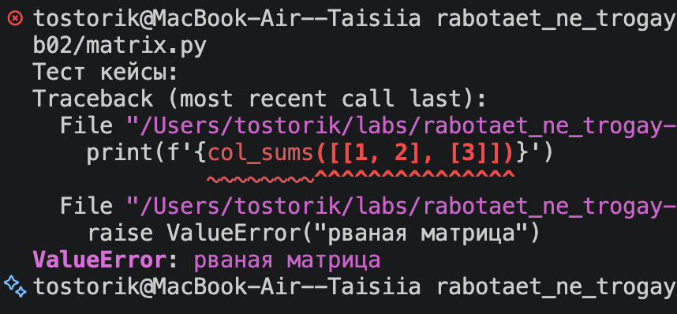
##### Рис.11 Иллюстрация работы программы(matrix), функции col_sums

## Задание 3

### tuples

### Входные данные и результат:
#### ("Иванов Иван Иванович", "BIVT-25", 4.6) → "Иванов И.И., гр. BIVT-25, GPA 4.60"
#### ("Петров Пётр", "IKBO-12", 5.0) → "Петров П., гр. IKBO-12, GPA 5.00"
#### ("Петров Пётр Петрович", "IKBO-12", 5.0) → "Петров П.П., гр. IKBO-12, GPA 5.00"
#### ("  сидорова  анна   сергеевна ", "ABB-01", 3.999) → "Сидорова А.С., гр. ABB-01, GPA 4.00"
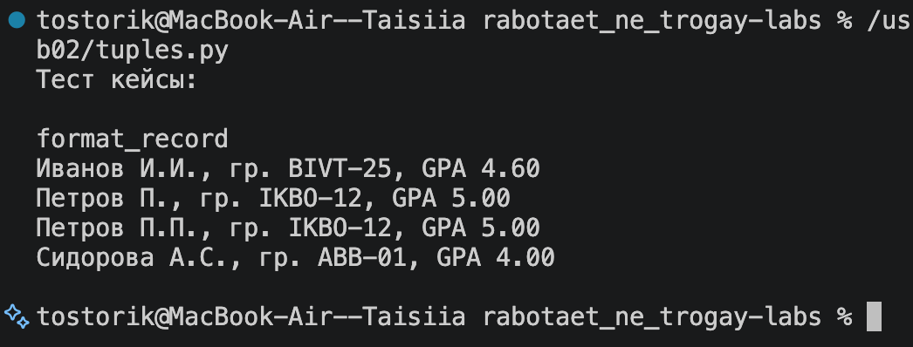
##### Рис.12 Иллюстрация работы программы(tuples), функции format_record

### Входные данные и результат:
#### ValueError
#### ("  ", "ABB-01", 3.999) -> ValueError: пустое ФИО
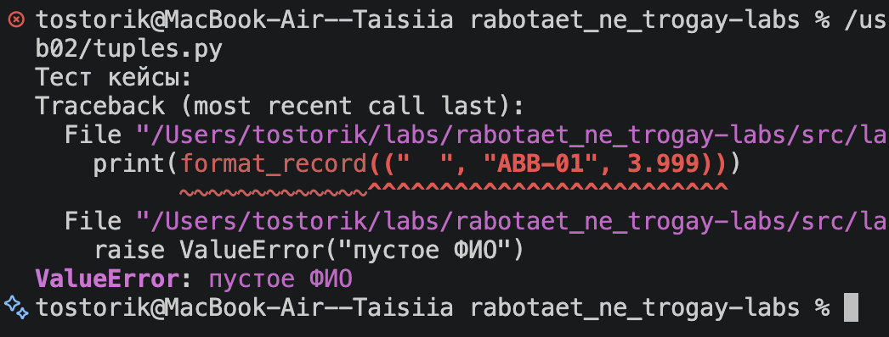
##### Рис.13 Иллюстрация работы программы(tuples), функции format_record
#### (" Анна ", "ABB-01", 3.999) -> ValueError: ФИО должно состоять из 2 или 3 слов
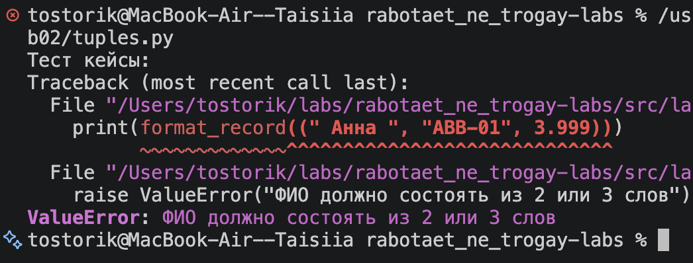
##### Рис.14 Иллюстрация работы программы(tuples), функции format_record
#### (" сидорова анна сергеевна ", "", 3.999) -> ValueError: пустая группа
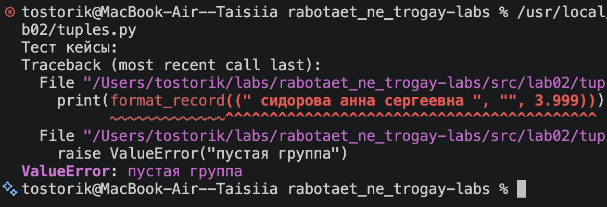
##### Рис.15 Иллюстрация работы программы(tuples), функции format_record
#### (" Иванов Ив42 Ив67ович ", "ABB-01", 3.999) -> ValueError: ФИО должно состоять только из букв
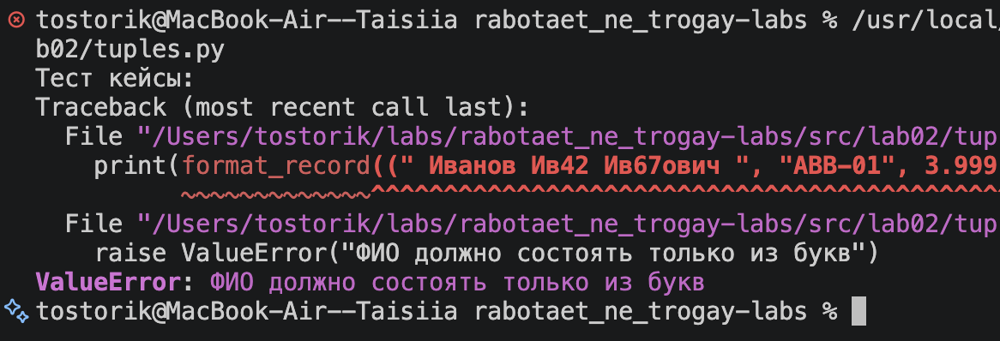
##### Рис.16 Иллюстрация работы программы(tuples), функции format_record

### Входные данные и результат:
#### TypeError
#### ("Магомед Магомедов ", "ABB-01", "3.999") -> TypeError: gpa должен быть числом (int или float)
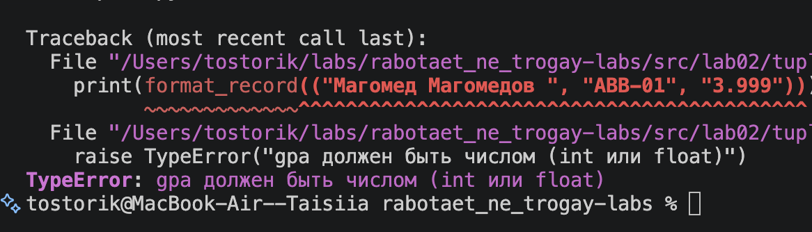
##### Рис.17 Иллюстрация работы программы(tuples), функции format_record
#### (["Ойякиви Сергей Александрович"], "BIVT-26-6-1", 3.999) -> TypeError: fio должно быть строкой
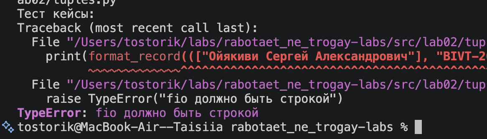
##### Рис.18 Иллюстрация работы программы(tuples), функции format_record
#### ("Люблюмаму Оченьсильно", ["BIVT-26-6-1"], 3.999) -> TypeError: group должна быть строкой
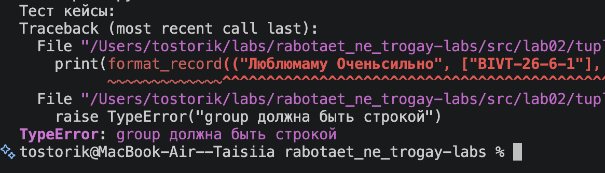
##### Рис.19 Иллюстрация работы программы(tuples), функции format_record