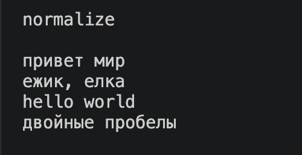
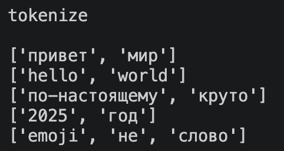
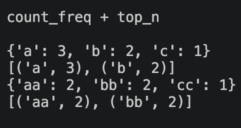
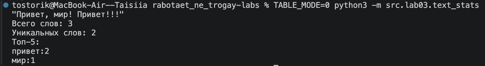
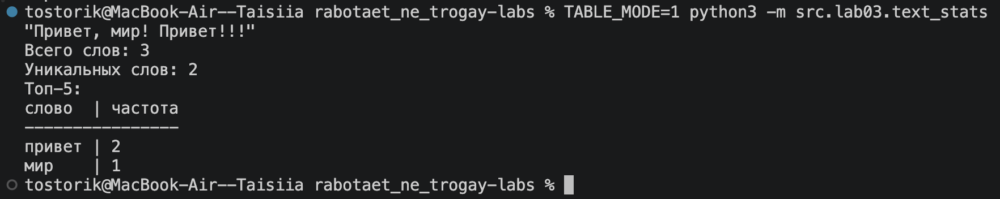

# Лабораторная работа 3
## Задание 1

### 1. Функция `normalize`

```python
def normalize(text: str, *, casefold: bool = True, yo2e: bool = True) -> str:
    """Нормализует строку.

    casefold=True  -> text.casefold(), иначе text.lower().
    yo2e=True      -> ё/Ё заменяются на е/Е.
    Управляющие символы (\\t, \\r, \\n и др.) заменяются пробелами,
    повторяющиеся пробелы схлопываются, края обрезаются.
    Args:
        text: Исходная строка.
        casefold: Если True, используется ``str.casefold()`` (корректнее для
            Юникода, например «ß» -> «ss»). Если False, используется
            ``str.lower()``.
        yo2e: Если True, все «ё»/«Ё» заменяются на «е»/«Е».

    Returns:
        Нормализованная строка.
    """
    text = text.casefold() if casefold else text.lower()

    if yo2e:
        text = text.replace("ё", "е").replace("Ё", "Е")
        
    text = "".join(
        " " if unicodedata.category(ch) == "Cc" else ch for ch in text
    )

    return " ".join(text.split())

```

### Входные данные и результат (тест-кейсы)

#### "ПрИвЕт\nМИр\t" → "привет мир" (casefold + схлопнуть пробелы)
#### "ёжик, Ёлка" (yo2e=True) → "ежик, елка"
#### "Hello\r\nWorld" → "hello world"
#### "  двойные   пробелы  " → "двойные пробелы"


#### Рис.1 Результат работы функции normalize. Реализовано преобразование строки: риведение к нижнему регистру, замена ё/Ё на е/Е, удаление управляющих символов и лишних пробелов.

### 2. Функция `tokenize`

```python
def tokenize(text: str) -> list[str]:
    """Разбивает текст на слова: \\w+ с возможными дефисами внутри слова.
    Числа считаются словами.
    
     Args:
        text: Строка, обычно уже прошедшая ``normalize``.

    Returns:
        Список слов в порядке их появления в тексте.
    """
    return re.compile(r"\w+(?:-\w+)*").findall(text)
```
### Входные данные и результат (тест-кейсы)

#### "привет мир" → ["привет", "мир"]
#### "hello,world!!!" → ["hello", "world"]
#### "по-настоящему круто" → ["по-настоящему", "круто"]
#### "2025 год" → ["2025", "год"]
#### "emoji 😀 не слово" → ["emoji", "не", "слово"]


#### Рис.2 Результат работы функции tokenize. Реализовано разбиение текста на слова (буквы, цифры, знак подчеркиваниея) по разделителям (дефис внутри слов сохраняется).

### 3. Функция `count_freq + top_n`

```python
def count_freq(tokens: list[str]) -> dict[str, int]:
    """Возвращает словарь «слово -> количество».
    
    Args:
        tokens: Список слов (например, результат ``tokenize``).

    Returns:
        Словарь «слово -> количество вхождений»
    """
    freq = {}
    for token in tokens:
        freq[token] = freq.get(token, 0) + 1
    return dict(sorted(freq.items()))


def top_n(freq: dict[str, int], n: int = 5) -> list[tuple[str, int]]:
    """Топ-N по убыванию частоты; при равенстве частот — по алфавиту.
    
    Args:
        freq: Словарь «слово -> количество» (результат ``count_freq``).
        n: Сколько слов вернуть. Если ``n <= 0``, возвращается пустой список.

    Returns:
        Список пар ``(слово, частота)`` длиной не более ``n``.
    """
    if n <= 0:
        return []
    return sorted(freq.items(), key=lambda p: (-p[1], p[0]))[:n]

```
### Входные данные и результат (тест-кейсы)

#### Токены ["a","b","a","c","b","a"] → частоты {"a":3,"b":2,"c":1}; 
#### top_n(..., n=2) → [("a",3), ("b",2)]
#### При равенстве частот: токены ["bb","aa","bb","aa","cc"] → частоты {"aa":2,"bb":2,"cc":1}; 
#### top_n(..., n=2) → [("aa",2), ("bb",2)] (алфавитная сортировка при равенстве).


#### Рис.3 Результат работы функции count_freq + top_n. Реализован подсчет частоты встречаемости токенов(count_freq). Реализован возврат первых N часто встречающихся слов с алфавитной сортировкой при равенстве частот(top_n). 

## Задание 2

### Код 

```python
from src.lib.text import normalize, tokenize, count_freq, top_n
import os

TABLE_MODE = os.getenv("TABLE_MODE", "0") == "1"
'''Порядок работы:
        1. Читает одну строку через ``input()``.
        2. Нормализует текст, разбивает на слова и считает частоты.
        3. Печатает обычный вывод: всего слов, уникальных слов, топ-5.
        4. Печатает топ-5 в виде таблицы «слово | частота». Ширина первого
           столбца равна длине самого длинного слова из топа (но не меньше
           длины заголовка «слово»).'''
           


def main() -> None:
    """Читает строку из stdin, считает слова и печатает результат.
    Args:
        Нет. Текст читается из stdin через ``input()``.

    Returns:
        None. Результат печатается в stdout.
        
    Raises:
        ValueError: Если текст не введён (нет ввода, пустая строка или
            только пробелы).
    """
    try:
        text = input()
    except EOFError:
        raise ValueError("Текст не введён") from None

    if not text.strip():
        raise ValueError("Текст не введён")

    tokens = tokenize(normalize(text))
    freq = count_freq(tokens)
    top = top_n(freq, 5)

    print(f"Всего слов: {len(tokens)}")
    print(f"Уникальных слов: {len(freq)}")
    print("Топ-5:")

    if TABLE_MODE: #таблица
        width = max([len("слово")] + [len(word) for word, _ in top])
        print("слово".ljust(width) + " | частота")
        print("-" * (width + 10))
        for word, count in top:
            print(word.ljust(width) + " | " + str(count))
    else: #обычный вывод
        for word, count in top:
            print(f"{word}:{count}")


if __name__ == "__main__":
    main()
    
```

Скрипт text_stats.py читает одну строку текста из стандартного ввода (stdin), то есть из потока, по которому программа получает данные с клавиатуры. Затем он нормализует текст, разбивает его на слова, считает частоты и выводит общее число слов, число уникальных слов и топ-5 самых частых слов в обычном виде и в виде таблицы. Если текст не введён, выбрасывается ValueError.

### Примеры вывода программы

#### 1.Обычный вывод 

##### Рис.4 Результат запуска скрипта в обычном режиме


#### 2.Табличный вывод 

##### Рис.5 Результат запуска скрипта в табличном режиме