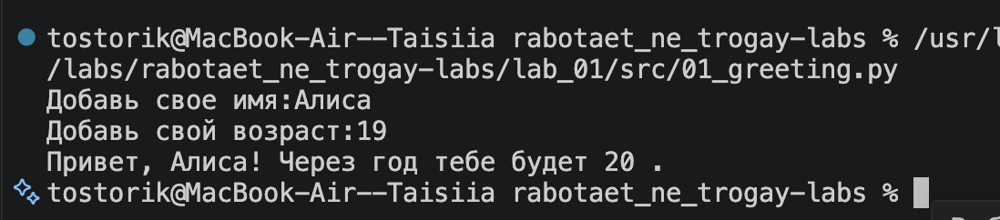

# rabotaet_ne_trogay-labs
кодю как могу

# Лабораторная работа 1
## Задание 1

### Входные данные: 
#### Имя: Алиса
#### Возраст: 19

## Задание 2

### Входные данные:
#### Первое число: 3,5
#### Второе число: 4.25 

## Задание 3

### Входные данные:
#### price=1000, discount=10, vat=20

## Задание 4

#### Входные данные:
#### Минуты: 135

## Задание 5

### Входные данные:
#### ФИО:   Иванов   Иван   Иванович

## Задание 6

### Входные данные:
#### 3
#### Максимов Максим 18 True
#### Геннадьев Геннадий 17 False
#### Алексеев Алексей 17 True

## Задание 7

### Входные данные:
#### thisisabracadabraHt1eadljjl12ojh.

